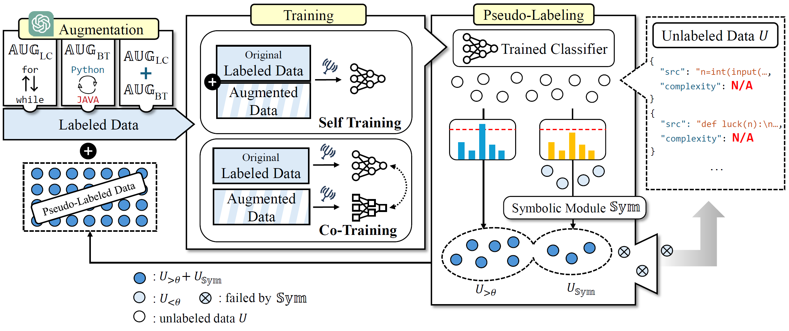
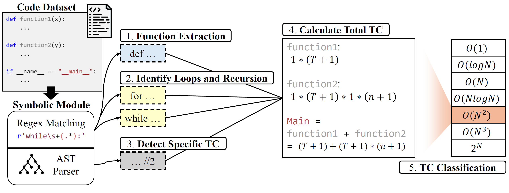

# TCProF: Time-Complexity Prediction SSL Framework  
[**📖 Paper**](https://arxiv.org/abs/2502.15749) | [**💾 Code**](https://github.com/peer0/few-shot-tc.git)  

## 🚀 TL;DR  

TCProF is a **semi-supervised learning (SSL) framework** for predicting **time complexity** of code snippets in **low-resource settings**.  
It introduces **data augmentation, symbolic analysis, and co-training mechanisms**, achieving **over 60% improvement** compared to self-training approaches.  
TCProF significantly outperforms baseline SSL methods and even competes with **LLMs like ChatGPT-4** in certain cases.

---

## 📌 About TCProF

### 🧐 Problem Statement  
Determining **the exact time complexity of a given code is theoretically undecidable**.  
While deep learning models have been trained for this task, they heavily rely on **large annotated datasets**, which are expensive and difficult to obtain.  
**How can we train a robust time complexity predictor with only a few labeled examples?**

### 💡 Our Approach  
TCProF tackles this problem through **three key components**:
1. **Data Augmentation (AUG)**: Enhancing training data using **loop transformations** and **back-translation (BT)**.
2. **Co-Training Mechanism**: Simultaneous training of two models (original and augmented) to prevent error propagation.
3. **Symbolic Module (SYM)**: Utilizing **Abstract Syntax Trees (ASTs) and Regex-based analysis** to improve pseudo-labeling accuracy.

>   
> _Overview of TCProF framework_

---

## 🛠 How It Works

### 🔹 Data Augmentation (AUG)  
We apply two augmentation techniques:
- **Back-Translation (BT)**: Translate code into another language and back to introduce variations while preserving logic.
- **Loop-Conversion (LC)**: Transform `for` loops into `while` loops and vice versa to enhance code diversity.

### 🔹 Co-Training Mechanism  
Instead of relying solely on a single self-training loop, we:
- Train two models: **one on original labeled data, one on augmented data**.
- Use **cross-model pseudo-labeling** to improve predictions iteratively.


### 🔹 Symbolic Analysis Module (SYM)  
To enhance **pseudo-labeling accuracy**, we analyze code complexity using:
- **Regex-based pattern matching** for loops, recursion, and sorting.
- **AST-based structure analysis** to infer the time complexity class.

>   
> _Symbolic analysis pipeline_

---

## 🏆 Performance Comparison  

### ✅ Key Findings:
- **60%+ accuracy improvement over self-training methods**.
- **Outperforms ChatGPT-4** in Python code time complexity prediction.
- **Effective in low-resource (few-shot) environments**.

---

### 📌 Accuracy on Benchmark Datasets  

| Method | Java (10-shot) | Python (10-shot) | CorCoD (10-shot) |
|--------|----------------|------------------|------------------|
| **Self-Training (ST)** | 31.77% | 40.98% | 45.61% |
| **JointMatch (SSL)** | 24.68% | 21.04% | 42.11% |
| **TCProF (Ours)** | **53.85%** | **70.29%** | **63.16%** |

> **Observations**:
> - TCProF significantly **outperforms baseline SSL methods**.
> - The **combination of augmentation and symbolic pseudo-labeling** is highly effective.
> - The model shows **strong generalization even with minimal labeled data**.

---

## 📈 Comparison with Large Language Models (LLMs)  

We also evaluate 10-shot TCProF against **ChatGPT-4, Gemini-Pro, and GPT-3.5** in a 5-shot setting.

| Model | Java | Python | CorCoD |
|-------|------|--------|--------|
| **Gemini-Pro** | 49.54% | 31.05% | 61.91% |
| **GPT-3.5** | 62.15% | 32.55% | 69.42% |
| **GPT-4** | **64.01%** | 53.04% | **78.86%** |
| **TCProF (Ours)** | 53.85% | **70.29%** | 63.16% |


---

## 📥 Installation & Usage  

### 🔧 Setup  
Clone the repository and install dependencies:
```bash
git clone https://github.com/peer0/few-shot-tc.git
cd code
pip install -r requirements.txt
```


### 🏋️ Training TCProF  

To train **TCProF** with `UniXcoder` on **CodeComplex-Python (5-shot, natural augmentation)**, run:

```bash
python3 cross_main_ssl.py \
    --config configs/unixcoder.json \
    --n_labeled_per_class 5 \
    --aug natural \
    --psl_threshold_h 0.8 \
    --lr 2e-6 \
    --seed 42 \
    --language python \
```

### 🔹 Training Options  

| Argument | Description |
|----------|-------------|
| `--config` | Model configuration file (e.g., `configs/unixcoder.json`) |
| `--n_labeled_per_class` | Number of labeled samples per class (`5` or `10`) |
| `--aug` | Augmentation strategy (`natural` or `artificial`) |
| `--psl_threshold_h` | Confidence threshold for pseudo-labeling (default: `0.8`) |
| `--lr` | Learning rate (default: `2e-6`) |
| `--seed` | Random seed for reproducibility (default: `42`) |
| `--language` | Target dataset (`corcod`, `python`, `java`) |

You can adjust parameters to train on different datasets, augmentation settings, or number of labeled samples.


---

## 🔬 Future Work  

🚀 **Expanding to More Programming Languages**  
- Currently supports **Java & Python**, aiming for **C++, JavaScript, and Rust** integration.

🧠 **Space Complexity Prediction**  
- Future research will explore **predicting space complexity** in addition to time complexity.

🆕 **Zero-Shot Generalization**  
- Investigating how to apply **symbolic modules** for **zero-shot** time complexity prediction.

---

## 🔗 Citation  

If you use TCProF in your research, please cite:

```bibtex
@article{HahnAKLH25,
  title={TCProF: Time-Complexity Prediction SSL Framework},
  author={Joonghyuk Hahn and Hyeseon Ahn and Jungin Kim and Soohan Lim and Yo-Sub Han},
  journal={ArXiv},
  year={2025},
  url={https://arxiv.org/abs/2502.15749}
}
```
